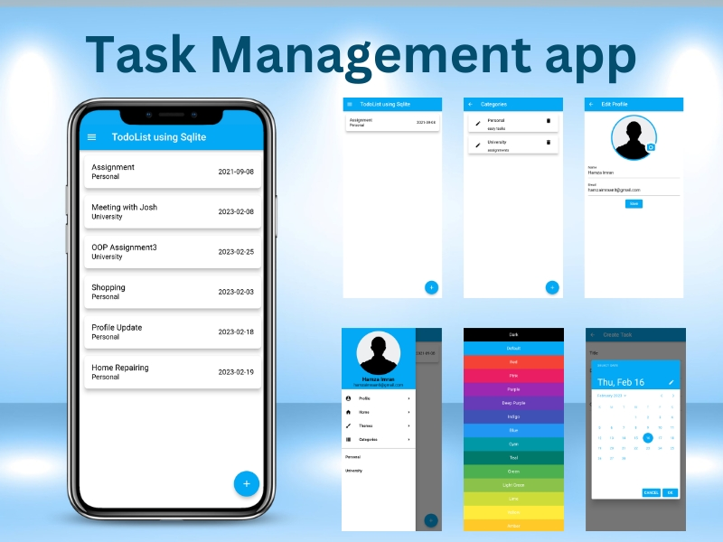
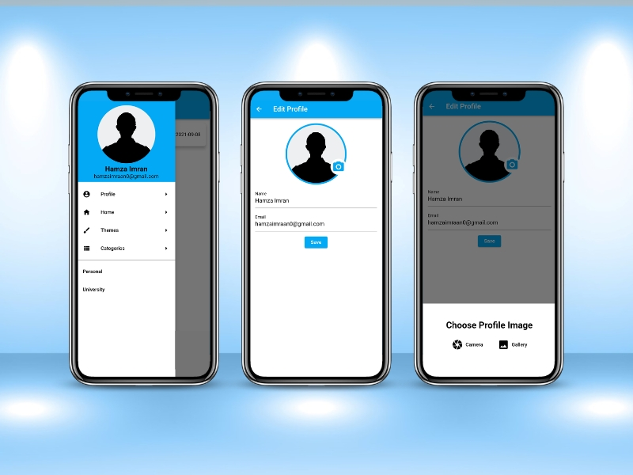
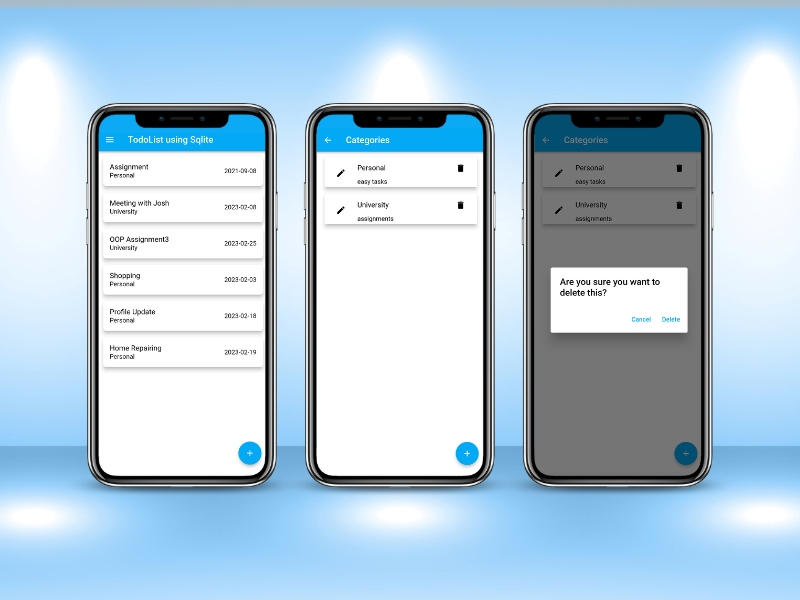

# DoIt - Task Management Flutter Application

DoIt is a task management Flutter application designed to help users stay organized and effectively manage their tasks and categories. The app incorporates various packages and follows clean and reusable coding practices to provide a smooth and efficient user experience.

## Packages Used

The following Flutter packages are used in the development of the DoIt application:

- **sqflite**: Version 2.0.2 - A Flutter plugin for SQLite database operations, enabling efficient local storage of tasks and categories.

- **path_provider**: Version 2.0.9 - A Flutter plugin that provides access to the device's file system, used to access local storage paths for database operations.

- **intl**: Version 0.17.0 - A Flutter package that provides internationalization and localization support, allowing the app to be localized for multiple languages.

- **cupertino_icons**: Version 1.0.2 - A Flutter package that provides the Cupertino-style icons used for the app's user interface.

- **provider**: Version 6.0.2 - A state management package that follows the provider pattern, facilitating efficient state management and data sharing across the app.

- **image_picker**: Version 0.8.5 - A Flutter plugin that allows users to pick images from the device's gallery or camera, used for adding images to tasks or categories.

- **permission_handler**: Version 9.2.0 - A Flutter plugin that handles runtime permissions, ensuring proper permission handling for image selection and storage access.

## Clean and Reusable Code

The DoIt application adheres to clean coding practices, emphasizing code reusability and maintainability. Key aspects of clean and reusable code in the project include:

- **Modularity**: The codebase is organized into modular components, ensuring separation of concerns and promoting code reuse.

- **Separation of UI and Logic**: The application follows a clear separation between the user interface (UI) and business logic, making it easier to modify and enhance the app's functionalities.

- **DRY (Don't Repeat Yourself) Principle**: The project avoids code duplication by abstracting common functionalities into reusable functions or components.

- **Efficient State Management**: The provider package is utilized for state management, ensuring efficient data flow and minimizing unnecessary UI updates.

## Features

The DoIt application offers the following features to enhance task management:

- **Profile Management**: Users can create and manage their profiles, including their name, profile picture, and preferences.

- **Themes**: The app provides various themes and customization options, allowing users to personalize the app's appearance.

- **Task Management**: Users can create, update, and delete tasks, set due dates and priorities, and mark tasks as completed.

- **Categories Management**: Users can create and manage categories to organize their tasks efficiently, enabling them to group related tasks together.

The DoIt application aims to provide a user-friendly and efficient task management experience, ensuring users can stay organized and focused on their tasks.

## Screenshots

